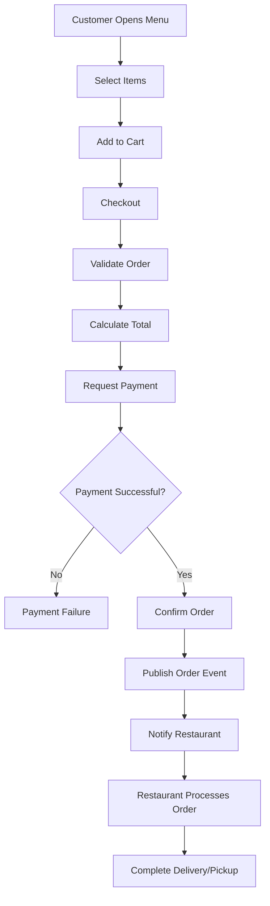

# Order Processing Activity

```mermaid
flowchart TD

    A[Customer Opens Menu] --> B[Select Items]
    B --> C[Add to Cart]
    C --> D[Checkout]
    D --> E[Validate Order]
    E --> F[Calculate Total]
    F --> G[Request Payment]
    G --> H{Payment Successful?}

    H -->|No| I[Payment Failure]
    H -->|Yes| J[Confirm Order]

    J --> K[Publish Order Event]
    K --> L[Notify Restaurant]
    L --> M[Restaurant Processes Order]
    M --> N[Complete Delivery/Pickup]
```