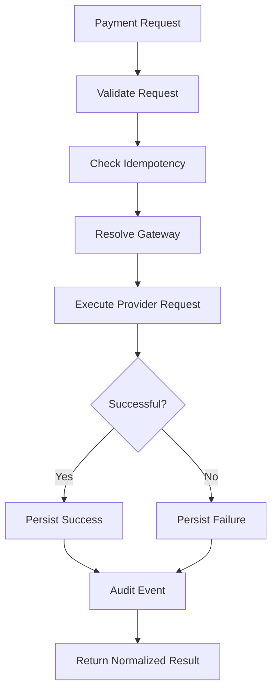

# Payment Processing Activity

```mermaid
flowchart TD

    A[Payment Request] --> B[Validate Request]
    B --> C[Check Idempotency]
    C --> D[Resolve Gateway]
    D --> E[Execute Provider Request]
    E --> F{Successful?}

    F -->|Yes| G[Persist Success]
    F -->|No| H[Persist Failure]

    G --> I[Audit Event]
    H --> I

    I --> J[Return Normalized Result]
```