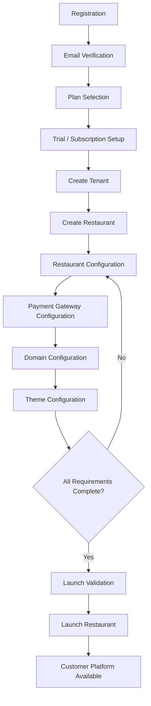

# Restaurant Onboarding Activity

```mermaid
flowchart TD

    A[Registration] --> B[Email Verification]
    B --> C[Plan Selection]
    C --> D[Trial / Subscription Setup]
    D --> E[Create Tenant]
    E --> F[Create Restaurant]
    F --> G[Restaurant Configuration]
    G --> H[Payment Gateway Configuration]
    H --> I[Domain Configuration]
    I --> J[Theme Configuration]
    J --> K{All Requirements Complete?}

    K -->|No| G
    K -->|Yes| L[Launch Validation]
    L --> M[Launch Restaurant]
    M --> N[Customer Platform Available]
```