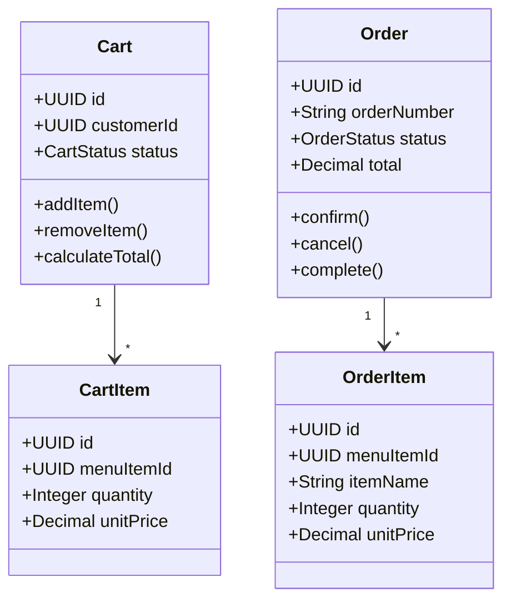

# Commerce Class Diagram

```mermaid
classDiagram

    class Cart {
        +UUID id
        +UUID customerId
        +CartStatus status
        +addItem()
        +removeItem()
        +calculateTotal()
    }

    class CartItem {
        +UUID id
        +UUID menuItemId
        +Integer quantity
        +Decimal unitPrice
    }

    class Order {
        +UUID id
        +String orderNumber
        +OrderStatus status
        +Decimal total
        +confirm()
        +cancel()
        +complete()
    }

    class OrderItem {
        +UUID id
        +UUID menuItemId
        +String itemName
        +Integer quantity
        +Decimal unitPrice
    }

    Cart "1" --> "*" CartItem
    Order "1" --> "*" OrderItem
```