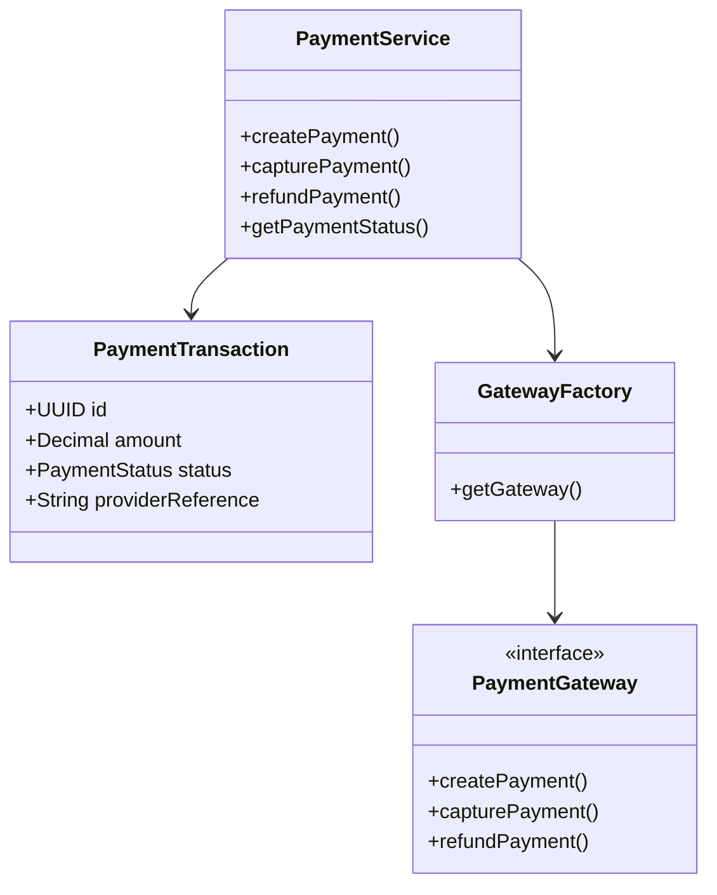

# Payment Class Diagram

```mermaid
classDiagram

    class PaymentService {
        +createPayment()
        +capturePayment()
        +refundPayment()
        +getPaymentStatus()
    }

    class PaymentGateway {
        <<interface>>
        +createPayment()
        +capturePayment()
        +refundPayment()
    }

    class PaymentTransaction {
        +UUID id
        +Decimal amount
        +PaymentStatus status
        +String providerReference
    }

    class GatewayFactory {
        +getGateway()
    }

    PaymentService --> GatewayFactory
    GatewayFactory --> PaymentGateway
    PaymentService --> PaymentTransaction
```

The abstraction prevents Payment Service business logic from depending on a specific payment provider.