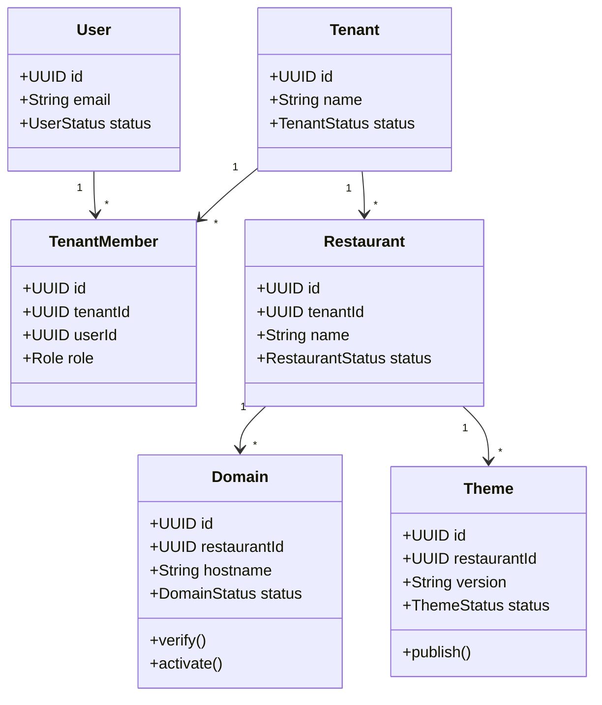

# Platform Class Diagram

```mermaid
classDiagram

    class User {
        +UUID id
        +String email
        +UserStatus status
    }

    class Tenant {
        +UUID id
        +String name
        +TenantStatus status
    }

    class TenantMember {
        +UUID id
        +UUID tenantId
        +UUID userId
        +Role role
    }

    class Restaurant {
        +UUID id
        +UUID tenantId
        +String name
        +RestaurantStatus status
    }

    class Domain {
        +UUID id
        +UUID restaurantId
        +String hostname
        +DomainStatus status
        +verify()
        +activate()
    }

    class Theme {
        +UUID id
        +UUID restaurantId
        +String version
        +ThemeStatus status
        +publish()
    }

    User "1" --> "*" TenantMember
    Tenant "1" --> "*" TenantMember
    Tenant "1" --> "*" Restaurant
    Restaurant "1" --> "*" Domain
    Restaurant "1" --> "*" Theme
```