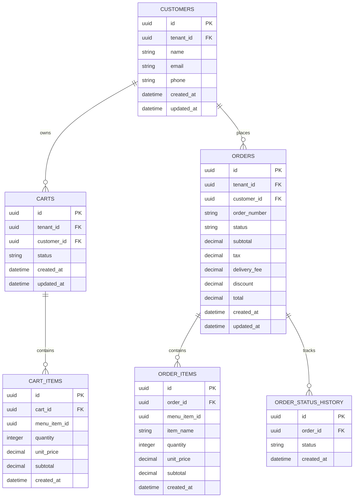

# Commerce ERD

## Purpose

This ERD represents the core customer commerce domain.

Commerce owns carts, orders, order items, and order lifecycle information.

Payment execution remains owned by the Payment Service.

## Ownership

The Commerce Service owns:

- Carts
- Cart Items
- Orders
- Order Items
- Order Status
- Order Status History
- Commerce calculations

Payment transactions are not stored as Commerce-owned authoritative records.