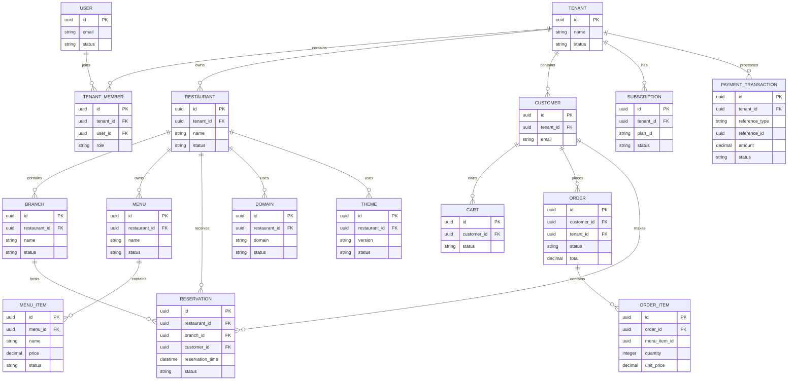

# Complete FluxDine ERD

## Purpose

This document provides the high-level logical relationship model across the major FluxDine platform domains.

It is not a physical database diagram.

FluxDine uses Database-per-Service architecture, therefore the entities below represent service-owned domains and their logical relationships.



## Important Architectural Constraint

The diagram does **not** authorize cross-service database joins.

For example:

```text
Commerce Service
      X
Restaurant Database
```

Instead:

```text
Commerce Service
      ↓
Restaurant Service API / Event
```

The Complete ERD is a logical architecture artifact, not a shared database design.