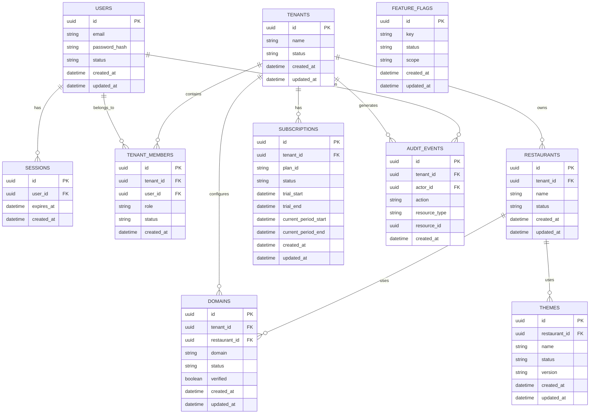

# Platform ERD

## Purpose

This ERD represents the platform-level entities responsible for identity, tenants, restaurant ownership, domains, themes, subscriptions, feature flags, and platform administration.

The diagram represents logical ownership rather than a single physical database.

FluxDine follows the Database-per-Service architecture. Each service owns its own database.

## Ownership Boundaries

| Entity | Owning Service |
|---|---|
| Users | Identity Service |
| Sessions | Identity Service |
| Tenants | Tenant Service |
| Tenant Members | Tenant Service |
| Restaurants | Restaurant Service |
| Domains | Domain Service |
| Themes | Theme Service |
| Subscriptions | Billing Service |
| Feature Flags | Feature Flag Service |
| Audit Events | Audit Service |

These relationships represent logical relationships only. Services shall not directly access another service's database.