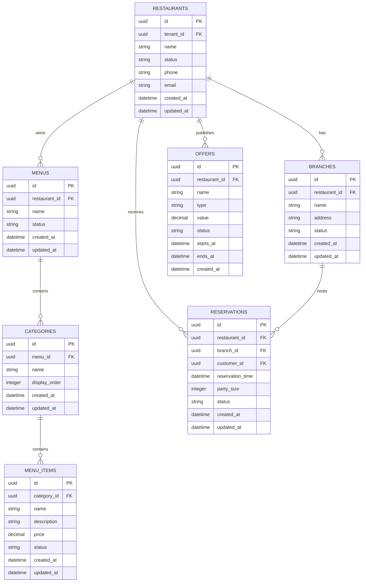

# Restaurant ERD

## Purpose

This ERD represents restaurant operational data and menu management.

## Ownership

Restaurant Service owns restaurant registry and operational restaurant configuration.

Commerce consumes menu information through approved service interfaces rather than directly accessing Restaurant Service tables.