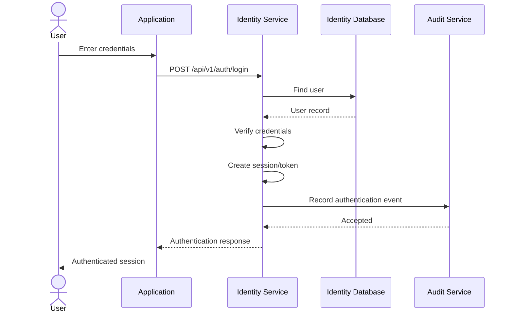

# Authentication Sequence

## Rules

- Identity Service owns authentication.
- Applications do not validate passwords themselves.
- Authentication events may be audited.
- Tokens/session information must not expose sensitive credentials.