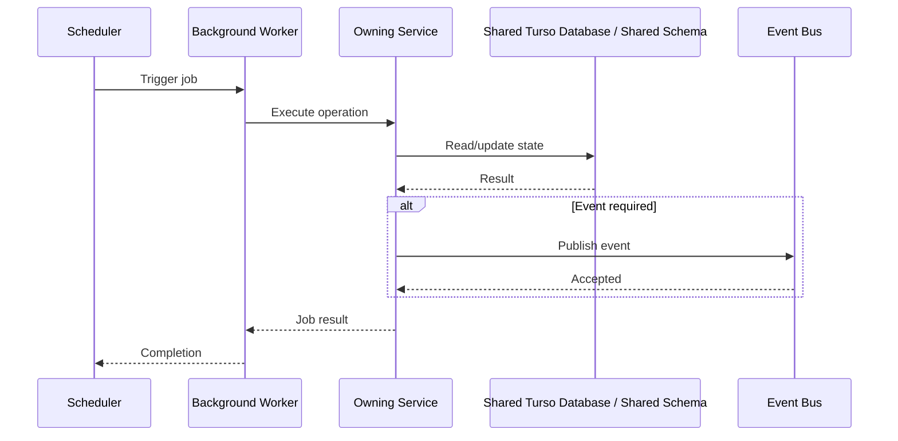

# Background Jobs Sequence

```mermaid
sequenceDiagram

    participant Scheduler as Scheduler
    participant Worker as Background Worker
    participant Service as Owning Service
    participant DB as Shared Turso Database / Shared Schema
    participant EventBus as Event Bus

    Scheduler->>Worker: Trigger job
    Worker->>Service: Execute operation
    Service->>DB: Read/update state
    DB-->>Service: Result

    alt Event required
        Service->>EventBus: Publish event
        EventBus-->>Service: Accepted
    end

    Service-->>Worker: Job result
    Worker-->>Scheduler: Completion
```

## Rules

Scheduled jobs must be server-side.

Client applications shall never be the authoritative scheduler for business lifecycle transitions.