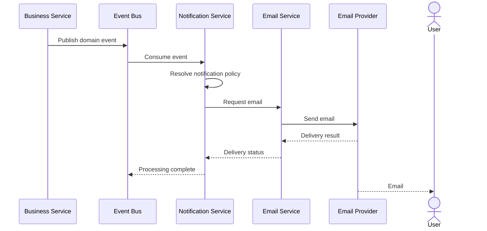

# Notification Flow

```mermaid
sequenceDiagram

    participant Source as Business Service
    participant EventBus as Event Bus
    participant Notification as Notification Service
    participant Email as Email Service
    participant Provider as Email Provider
    actor User

    Source->>EventBus: Publish domain event
    EventBus->>Notification: Consume event
    Notification->>Notification: Resolve notification policy
    Notification->>Email: Request email
    Email->>Provider: Send email
    Provider-->>Email: Delivery result
    Email-->>Notification: Delivery status
    Notification-->>EventBus: Processing complete
    Provider-->>User: Email
```

Notification orchestration and email transport remain separate services.