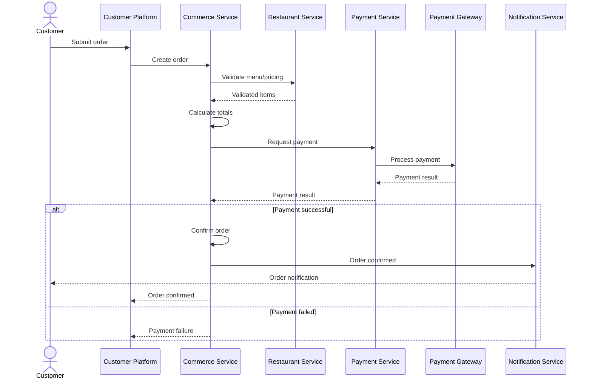

# Order Placement Sequence

```mermaid
sequenceDiagram

    actor Customer
    participant Web as Customer Platform
    participant Commerce as Commerce Service
    participant Restaurant as Restaurant Service
    participant Payment as Payment Service
    participant Gateway as Payment Gateway
    participant Notification as Notification Service

    Customer->>Web: Submit order
    Web->>Commerce: Create order

    Commerce->>Restaurant: Validate menu/pricing
    Restaurant-->>Commerce: Validated items

    Commerce->>Commerce: Calculate totals
    Commerce->>Payment: Request payment

    Payment->>Gateway: Process payment
    Gateway-->>Payment: Payment result

    Payment-->>Commerce: Payment result

    alt Payment successful
        Commerce->>Commerce: Confirm order
        Commerce->>Notification: Order confirmed
        Notification-->>Customer: Order notification
        Commerce-->>Web: Order confirmed
    else Payment failed
        Commerce-->>Web: Payment failure
    end
```

## Rules

Payment execution belongs to Payment Service.

Commerce owns the order lifecycle.