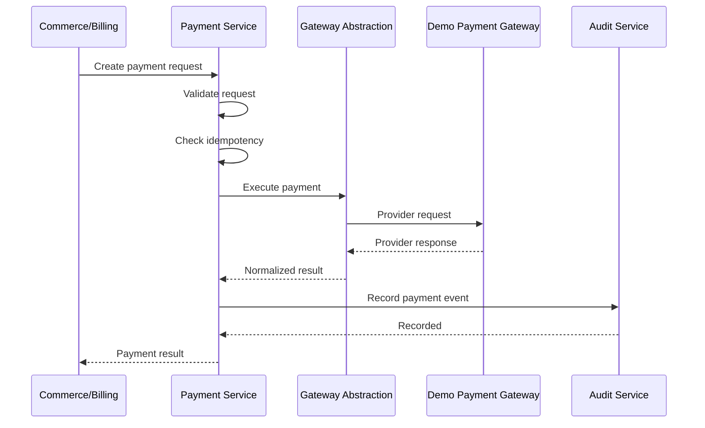

# Payment Flow



## Architectural Boundary

```text
Commerce / Billing
        ↓
Payment Service
        ↓
Payment Gateway Abstraction
        ↓
Demo Payment Gateway (CURRENT — Phase 07–08)
        ↓
(Future after Phase 08: Stripe Connect Gateway)
```

Consumers never communicate directly with payment providers.