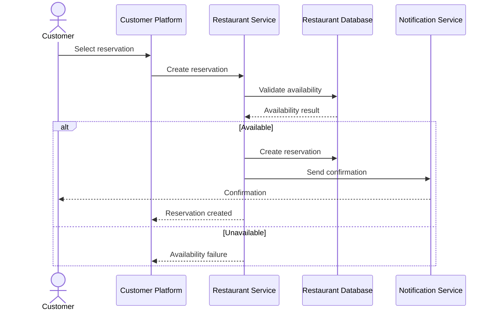

# Reservation Flow



## Lifecycle

```text
Pending
   ↓
Upcoming
   ↓
Active
   ↓
Fulfilled

Alternative:

Pending → Canceled
Upcoming → Canceled
Active → Canceled
```

Server-side scheduled jobs are authoritative for time-based transitions.