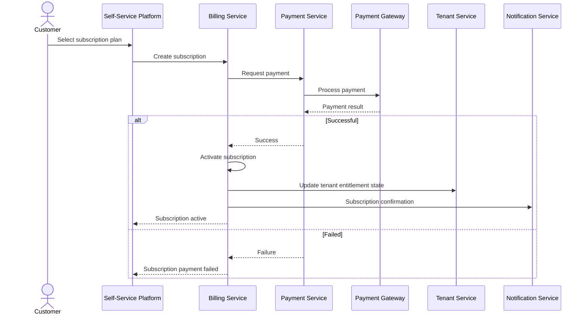

# Subscription Flow

```mermaid
sequenceDiagram

    actor Customer
    participant App as Self-Service Platform
    participant Billing as Billing Service
    participant Payment as Payment Service
    participant Gateway as Payment Gateway
    participant Tenant as Tenant Service
    participant Notification as Notification Service

    Customer->>App: Select subscription plan
    App->>Billing: Create subscription

    Billing->>Payment: Request payment
    Payment->>Gateway: Process payment
    Gateway-->>Payment: Payment result

    alt Successful
        Payment-->>Billing: Success
        Billing->>Billing: Activate subscription
        Billing->>Tenant: Update tenant entitlement state
        Billing->>Notification: Subscription confirmation
        Billing-->>App: Subscription active
    else Failed
        Payment-->>Billing: Failure
        Billing-->>App: Subscription payment failed
    end
```

Billing owns subscription lifecycle.

Payment owns payment execution.