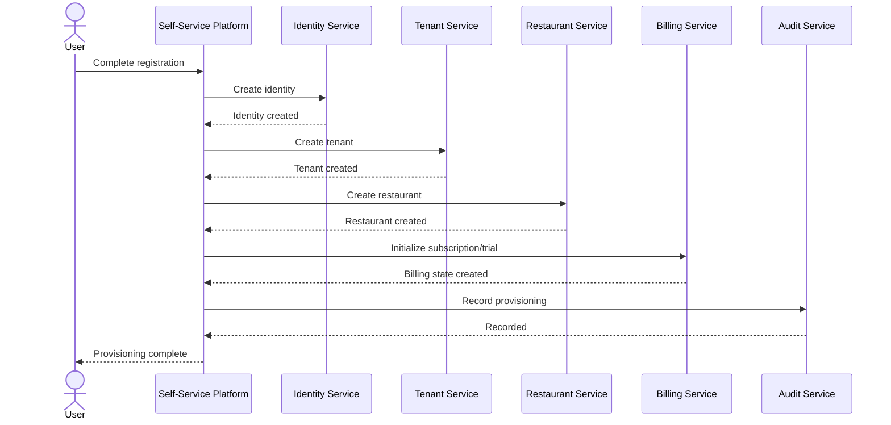

# Tenant Provisioning Sequence

```mermaid
sequenceDiagram

    actor User
    participant App as Self-Service Platform
    participant Identity as Identity Service
    participant Tenant as Tenant Service
    participant Restaurant as Restaurant Service
    participant Billing as Billing Service
    participant Audit as Audit Service

    User->>App: Complete registration
    App->>Identity: Create identity
    Identity-->>App: Identity created

    App->>Tenant: Create tenant
    Tenant-->>App: Tenant created

    App->>Restaurant: Create restaurant
    Restaurant-->>App: Restaurant created

    App->>Billing: Initialize subscription/trial
    Billing-->>App: Billing state created

    App->>Audit: Record provisioning
    Audit-->>App: Recorded

    App-->>User: Provisioning complete
```

## Rules

Tenant provisioning shall preserve service ownership.

No service may directly create records inside another service's database.