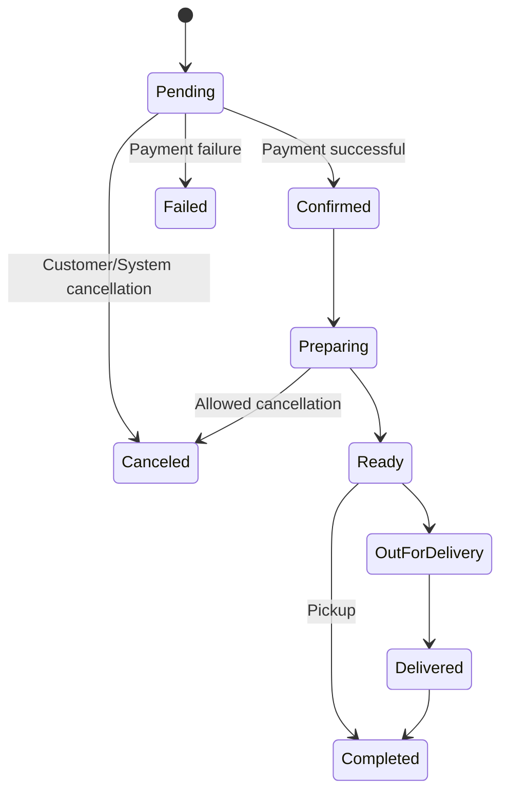

# Order State Diagram

```mermaid
stateDiagram-v2

    [*] --> Pending

    Pending --> Confirmed : Payment successful
    Pending --> Canceled : Customer/System cancellation

    Confirmed --> Preparing
    Preparing --> Ready
    Ready --> OutForDelivery
    Ready --> Completed : Pickup

    OutForDelivery --> Delivered
    Delivered --> Completed

    Pending --> Failed : Payment failure
    Preparing --> Canceled : Allowed cancellation
```

Invalid state transitions shall be rejected.